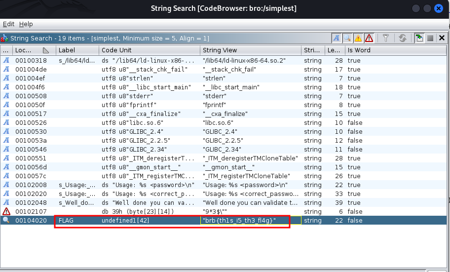
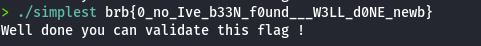

# Writeup Simplest

## Français

Après avoir analysé le fichier, nous pouvons voir qu'il s'agit d'un binaire ELF x64 non stripped, ce qui signifie que nous pouvons décompiler le binaire pour récupérer son pseudo-code :

Nous le décompilons avec Ghidra et nous découvrons l'appel à la fonction `are_equal`. Nous constatons que notre entrée est comparée à `FLAG` :

Nous vérifions ce que contient `FLAG` et essayons de le soumettre, mais sans succès :

Nous déboguons le binaire avec GDB pour analyser notre binaire instruction par instruction. Nous désassemblons la fonction `main` et plaçons un point d'arrêt sur l'appel à la fonction `are_equal` :

Petit rappel sur les conventions d'appel en x64 : en assembleur, lors de l'appel d'une fonction utilisant des paramètres, le premier paramètre est placé dans le registre `rdi`, le deuxième paramètre dans `rsi`, et le troisième dans `rdx`. Dans notre cas, notre entrée sera dans le registre `rdi` :

Nous exécutons le binaire avec une entrée arbitraire et atteignons le point d'arrêt. Nous pouvons voir le `FLAG` dans le registre `rsi` :

Et nous validons le challenge avec ce `FLAG`.

## English

After analyzing the file, we can see that it's an x64 ELF binary that is not stripped, so we can decompile the binary to retrieve its pseudo-code:

We decompile it with Ghidra and discover the call to the `are_equal` function. We can see that our input is compared to `FLAG`:

We verify what the `FLAG` holds and try to submit it, but no luck:

We debug the binary with GDB to analyze our binary instruction by instruction. We disassemble the `main` function and set a breakpoint on the call to the `are_equal` function:

Quick reminder: in x64 calling conventions in assembly, when calling a function using parameters, the first parameter is stored in the `rdi` register, the second in `rsi`, and the third in `rdx`. In our case, our input is going to be in the `rdi` register:

We run the binary with arbitrary input and reach the breakpoint. We can see the `FLAG` in the `rsi` register:

And we validate the challenge with that `FLAG`.

